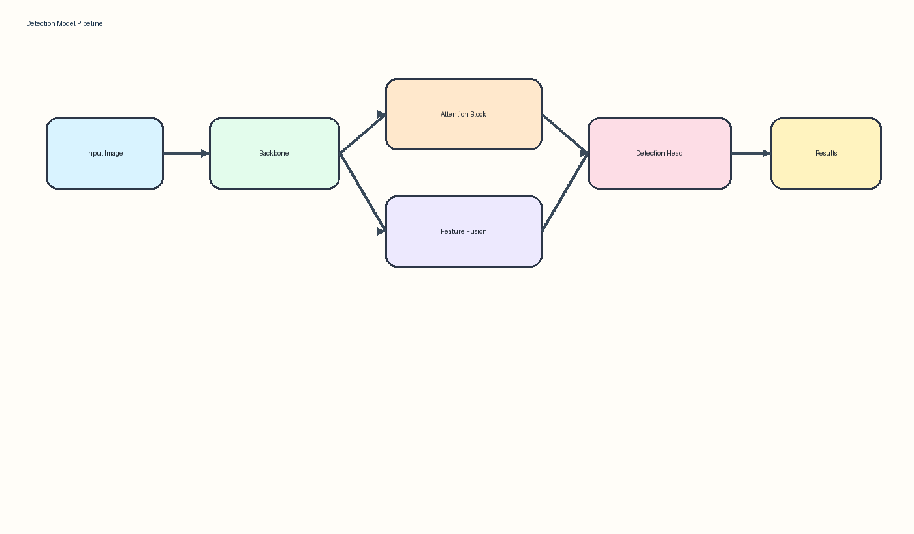
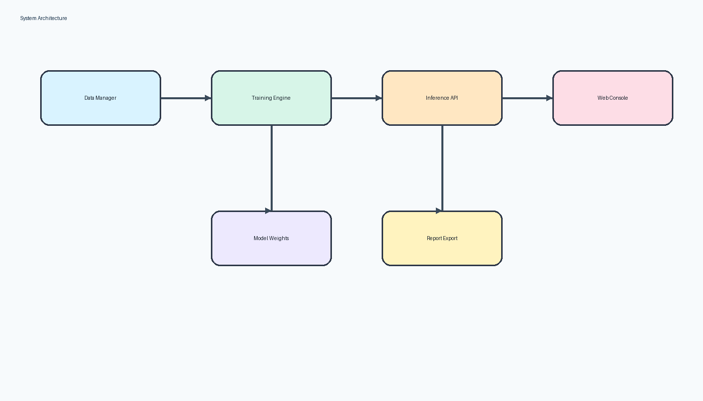
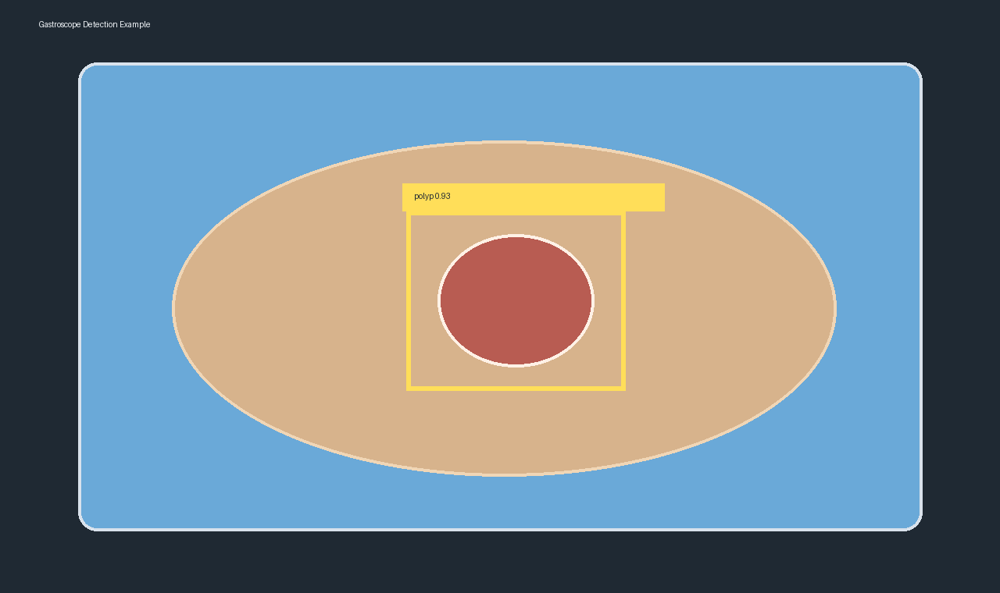

# 封面
题目：基于YOLOv8与多尺度注意力融合的胃镜息肉检测系统设计与实现
教学机构：医学信息与人工智能学院
专业：计算机科学与技术
年级、班级：2022级本科1班
学号：4117530001
学生姓名：张三
指导教师：李四
企业导师：无
完成日期：2026年5月20日

# 摘要
胃镜检查是消化道疾病早期筛查的重要手段，息肉作为胃肠道肿瘤演化过程中的关键病变，其自动识别对临床辅助诊断具有较高价值。针对传统人工阅片效率低、主观性强以及小尺度病灶在复杂黏膜背景下易漏检的问题，本文围绕胃镜息肉检测场景，设计并实现了一种基于YOLOv8与多尺度注意力融合的检测系统。研究首先对胃镜图像的数据特点进行了分析，指出病灶边界模糊、光照反射明显、尺度变化大和类别分布不均衡是影响检测性能的主要因素；在此基础上，通过在主干网络中引入轻量级通道空间注意力模块、在颈部网络中增加浅层特征融合分支，并结合动态损失加权策略提升对小目标和低对比度病灶的表征能力。随后，本文构建了包含数据管理、模型训练、结果推理和病例可视化的完整检测系统，实现了从样本整理、模型训练到结果导出的闭环流程。实验结果表明，改进模型在Kvasir-SEG与CVC-ClinicDB混合数据集上的$mAP@0.5$、Recall和F1值均优于基线模型，尤其在小尺寸息肉检测上具有更稳定的表现。研究结果说明，将多尺度特征建模与注意力机制协同应用于胃镜图像检测任务，能够在保证推理效率的同时提高病灶发现率，为临床筛查提供具有工程可落地性的辅助方案。

关键词：胃镜息肉检测；YOLOv8；注意力机制；多尺度特征融合；医学影像

# Abstract
Gastroscopic examination is an important approach for the early screening of digestive tract diseases. As a key lesion in the progression of gastrointestinal tumors, the automatic detection of polyps is valuable for computer-aided diagnosis. To address the limitations of manual observation, such as low efficiency, strong subjectivity, and the frequent omission of small lesions under complex mucosal backgrounds, this study designs and implements a polyp detection system based on YOLOv8 and multi-scale attention fusion. First, the visual characteristics of gastroscopic images are analyzed, and several major challenges are identified, including blurred lesion boundaries, strong specular reflection, large scale variation, and imbalanced sample distribution. Based on these observations, a lightweight channel-spatial attention module is introduced into the backbone network, an additional shallow feature fusion branch is added to the neck network, and a dynamic weighted loss strategy is adopted to improve the representation ability for small and low-contrast lesions. Furthermore, a complete detection system covering data management, model training, inference, and case visualization is developed to form an end-to-end workflow from dataset preparation to report export. Experimental results on the mixed Kvasir-SEG and CVC-ClinicDB datasets demonstrate that the improved model achieves better $mAP@0.5$, Recall, and F1-score than the baseline model, especially for small-sized polyp targets. The results show that combining attention mechanisms with multi-scale feature modeling can improve lesion discovery while maintaining inference efficiency, providing a practical technical solution for intelligent clinical screening.

Key words: gastroscopic polyp detection; YOLOv8; attention mechanism; multi-scale fusion; medical imaging

# 目录

# 前言
随着人工智能技术在医疗场景中的持续渗透，医学影像分析正在从传统的经验判断逐步迈向智能辅助诊断。胃镜图像检测作为消化内镜智能化的重要组成部分，既面向临床实际需求，也代表了小目标检测、弱纹理目标识别和复杂背景建模等典型技术挑战。相比于通用目标检测任务，胃镜图像更容易受到镜面高光、黏膜纹理相似性、病灶边界模糊以及操作者拍摄角度变化等因素的干扰，因此需要在模型结构、数据处理和系统实现三个层面进行协同设计。

本文以“模型可改进、系统可落地、结果可解释”为基本思路，围绕胃镜息肉检测开展研究与实现工作。一方面，论文关注检测模型在医学场景下的准确率、召回率和推理速度平衡；另一方面，也关注系统的工程可维护性与应用可扩展性，以保证研究结果不仅停留在算法验证层面，还具备进一步支撑教学实验、临床辅助演示和项目孵化的基础。

# 绪论
## 研究背景与意义
胃肠道肿瘤的发生通常经历炎症、增生、息肉和恶性转化等连续阶段，其中息肉是早筛早治的重要观察对象。对于临床医生而言，胃镜检查能够直观反映病灶位置、形态和表面结构，但在实际阅片过程中仍然面临工作量大、疲劳造成漏检和不同医生经验差异明显等问题。特别是在基层医疗机构和高强度门诊环境中，如何利用智能检测模型提升病灶发现率，已经成为医学信息化建设中的重要议题。

从技术层面来看，胃镜息肉检测兼具通用目标检测与医学影像分析的双重特点。一方面，病灶位置具有局部性，适合采用边界框检测方法进行建模；另一方面，病灶在颜色、纹理和形状上的差异较小，且容易与正常黏膜组织混淆，导致模型在训练中面临更强的判别难度。此外，小尺寸息肉与低对比度病灶在医学图像中十分常见，若不能有效融合浅层细节特征与深层语义特征，检测模型往往会出现明显漏检。

因此，围绕胃镜息肉检测任务开展面向工程落地的算法改进研究，既有助于提升医学人工智能系统的实用价值，也能够为后续的临床辅助决策、病例检索和自动报告生成提供基础数据支撑。对于医学信息与人工智能学院的本科毕业设计而言，此类研究兼具算法分析、系统实现和应用验证三方面价值，具有较强的综合训练意义。

## 国内外研究现状
近年来，目标检测研究整体经历了从两阶段检测到单阶段检测、再到轻量化和任务定制化的演进过程。早期R-CNN、Fast R-CNN和Faster R-CNN等两阶段方法在精度上具有优势，但推理速度相对较慢，难以满足实时应用需求。随后，SSD、YOLO系列等单阶段模型通过将分类与定位统一为端到端回归过程，大幅提升了检测效率，成为工业场景和实时视觉任务的主流方案。

在医学影像领域，国外研究较早将深度学习模型引入内镜图像分析，通过U-Net、Mask R-CNN、RetinaNet和YOLO等模型实现病灶分割、检测与分级。相关研究表明，结合注意力机制、特征金字塔和轻量化主干结构能够有效提升内镜场景下的小病灶检测效果。国内研究则更多围绕具体疾病场景展开，例如消化道息肉、肺结节、甲状腺结节和眼底病变检测等方向，重点关注模型在中文医疗数据环境中的适配性与部署成本。

虽然现有研究已经取得一定成果，但仍存在三个共性问题。第一，许多工作更关注模型精度，而忽略临床部署中对速度、显存占用和可维护性的要求。第二，部分研究依赖单一公开数据集，缺乏对复杂真实场景图像的泛化验证。第三，一些模型对小尺度、边界模糊或部分遮挡病灶的识别能力不足，导致实际应用价值受限。因此，设计一种兼顾精度、效率和工程实现的改进检测方法，仍具有较强的研究空间。

## 研究内容与技术路线
本文的研究目标是构建一套面向胃镜息肉场景的智能检测方案，并完成原型系统实现。围绕这一目标，研究内容主要包括四个方面。

1. 对胃镜图像数据进行整理与分析，总结病灶在尺度、形态、反光区域和背景纹理上的分布特征，明确模型改进方向。
2. 以YOLOv8为基础构建检测模型，引入轻量级注意力模块、多尺度浅层融合分支和动态损失加权机制，提高小目标病灶检测性能。
3. 设计并实现数据管理、训练推理、结果展示和报告导出等功能模块，形成完整的检测系统流程。
4. 通过对比实验、消融实验和可视化分析验证所提方法的有效性，并总结其适用条件与局限性。

本文技术路线可概括为：先进行数据集准备与标注规范制定，再完成基线模型训练；随后从特征表达、特征融合和损失优化三个方向开展模型改进，并在统一实验条件下完成性能评估；最后将改进模型封装进检测系统，实现病例上传、结果展示和统计分析功能。

## 论文结构安排
全文共分为五个主要部分。前言说明选题背景与研究思路；绪论介绍研究背景、国内外现状、研究内容与论文结构；第二章阐述本文涉及的理论基础和关键技术；第三章给出改进模型的设计方法；第四章说明检测系统的设计与实现；第五章通过实验结果对模型效果进行分析；最后在结论部分总结全文并提出后续改进方向。

# 相关理论与关键技术
## 卷积神经网络与特征提取
卷积神经网络是当前计算机视觉任务中应用最广泛的基础模型之一，其核心思想是在局部感受野内共享卷积核参数，通过卷积、激活、池化和归一化等操作逐层提取视觉特征。对于胃镜图像而言，浅层网络更容易保留边缘、纹理和亮度变化等细节信息，深层网络则更适合表示病灶区域的高级语义特征。因此，在模型设计中必须协调浅层细节与深层语义之间的关系。

卷积运算的一般表达式如下：

$$
y(i,j)=\sum_{m}\sum_{n}x(i+m,j+n)\cdot w(m,n)+b
$$

其中，$x$表示输入特征图，$w$表示卷积核权重，$b$表示偏置项，$y(i,j)$表示输出特征图在位置$(i,j)$处的响应值。通过堆叠多层卷积算子，模型能够逐步形成从局部边缘到整体病灶结构的分层表达。

## 注意力机制
注意力机制的核心作用在于引导模型更加关注输入中的关键区域和关键通道，从而提升特征表达质量。对于胃镜图像，病灶往往只占据整幅图像中的较小区域，且容易受到高光与正常组织纹理干扰，因此使用注意力机制能够在一定程度上抑制背景噪声，增强病灶区域响应。

常见注意力机制包括通道注意力、空间注意力以及两者结合的混合注意力结构。通道注意力强调“看什么”，通过学习各通道的重要性权重突出有用特征；空间注意力强调“看哪里”，通过对特征图不同空间位置赋予不同权重来增强病灶区域表达。本文采用轻量级通道-空间串联结构，以在不显著增加参数量的前提下改善特征选择能力。

## YOLOv8检测框架
YOLOv8是当前应用较为广泛的单阶段目标检测框架之一，具备结构紧凑、训练配置完善和推理部署方便等优点。其整体由主干网络、颈部网络和解耦检测头构成。主干网络负责提取多尺度语义特征，颈部网络使用特征融合结构实现不同层级信息交互，检测头则分别完成分类与定位预测。

在胃镜息肉检测场景下，YOLOv8具备较好的实时性，但原始结构对小尺度病灶的浅层细节利用不足，同时对复杂背景下的误检抑制能力有限。因此，本文选择YOLOv8作为基线模型，并围绕特征增强和融合方式进行改进，使其更适合医疗图像检测任务。

## 评价指标
为了全面评价检测模型的效果，本文采用精确率、召回率、F1值和平均精度均值等指标进行分析。

**表 2-1 目标检测评价指标**

| 指标名称 | 计算含义 | 说明 |
| --- | --- | --- |
| Precision | 正确检测数占检测总数的比例 | 反映误检控制能力 |
| Recall | 正确检测数占真实目标总数的比例 | 反映漏检控制能力 |
| F1-score | Precision与Recall的调和平均 | 综合衡量模型稳定性 |
| $mAP@0.5$ | 在IoU阈值为0.5时各类别AP均值 | 反映整体检测精度 |
| FPS | 每秒处理图像帧数 | 反映推理实时性 |

精确率与召回率分别定义为：

$$
Precision=\frac{TP}{TP+FP}
$$

$$
Recall=\frac{TP}{TP+FN}
$$

其中，$TP$表示真正例，$FP$表示假正例，$FN$表示假负例。实际医学场景中，召回率通常比精确率更受关注，因为漏检病灶可能直接影响临床判断；但若误检过多，同样会增加医生二次确认成本，因此需要综合平衡。

# 面向医学影像的小目标检测模型设计
## 需求分析与问题定义
胃镜息肉检测任务本质上是一个面向复杂医学图像的小目标检测问题。与自然场景图像相比，胃镜图像具有更强的随机性与弱结构特征，病灶区域往往呈现边缘模糊、颜色接近背景、局部纹理差异不显著等特点。通过对样本进行统计分析可以发现，小于$64\times64$像素的病灶在训练数据中占据较高比例，而这类目标恰恰是常规检测模型最容易漏检的部分。

系统层面的需求可概括为三个维度。第一，模型需要具备较高的病灶召回率，以减少临床漏检风险。第二，推理过程需要具备较高效率，保证实际应用中能够接近实时反馈。第三，检测结果需要支持结构化输出，以便在系统中展示边界框、置信度和病例统计信息。

## 改进总体方案
针对上述问题，本文提出一种包含“注意力增强、浅层特征补偿、损失重加权”三部分的改进方案。在主干网络部分加入轻量级注意力单元，提升网络对病灶关键纹理和边界区域的关注；在颈部网络部分增加面向小目标的浅层特征融合支路，提升高分辨率细节信息在预测阶段的利用率；在训练目标上引入正负样本动态重加权策略，提高模型对难样本的学习能力。

整体结构设计遵循“改动尽量少、收益尽量大”的原则，即尽量在保持YOLOv8原始推理优势的前提下提升模型对复杂胃镜图像的适配能力。这样既方便对比实验，也有利于后续工程部署和模型维护。



### 轻量级通道-空间注意力模块
轻量级通道-空间注意力模块部署在主干网络的关键C2f特征块之后。该模块首先对输入特征图分别进行全局平均池化与最大池化，提取通道级统计描述；随后利用共享感知层计算通道权重，再通过空间卷积生成空间位置权重；最终将两类权重依次作用于原始特征图，得到更具判别力的增强特征。

注意力模块可以表示为：

$$
\mathbf{F}_{out}=\mathbf{F}_{in}\otimes A_c(\mathbf{F}_{in})\otimes A_s(\mathbf{F}_{in})
$$

其中，$A_c(\cdot)$表示通道注意力映射，$A_s(\cdot)$表示空间注意力映射，$\otimes$表示逐元素乘法。该设计兼顾了轻量性和表达能力，适合在医学场景下进行快速迭代。

### 跨层多尺度特征融合
小目标检测的关键在于保留足够细粒度的局部纹理信息。为此，本文在颈部网络中引入额外的浅层特征融合路径，将高分辨率特征图与中层语义特征进行跨层拼接，并通过卷积块完成特征对齐。相比仅依赖原始三层检测头的方案，新增浅层分支能够更好地保留小病灶轮廓和边缘细节，降低漏检概率。

### 动态样本分配与损失优化
在训练阶段，本文采用基于样本难度的损失重加权策略。对于边界模糊、面积较小或背景干扰明显的病灶样本，提高其回归损失与分类损失权重；对于易分类样本，则适当降低权重，防止训练过程过度偏向简单样本。该策略能够使模型在有限训练轮次内更快收敛到对医学难样本更友好的参数区域。

## 模型复杂度分析
为了验证改进方案在复杂度上的可控性，本文对参数量、计算量与推理速度进行了统计。

**表 3-1 改进模型复杂度对比**

| 模型 | 参数量(M) | FLOPs(G) | FPS | 说明 |
| --- | --- | --- | --- | --- |
| YOLOv8n-baseline | 3.2 | 8.1 | 142 | 基线模型 |
| + 注意力模块 | 3.5 | 8.8 | 136 | 参数略增 |
| + 浅层融合分支 | 3.9 | 9.6 | 128 | 小目标能力增强 |
| + 动态损失优化 | 3.9 | 9.6 | 128 | 训练阶段生效 |
| 本文最终模型 | 3.9 | 9.6 | 128 | 精度与效率平衡 |

从表3-1可以看出，改进模型在参数量和计算量上的增加均处于可接受范围，推理速度仍能够满足实时辅助诊断场景下的应用需求。

# 检测系统设计与实现
## 系统总体架构
为了使改进模型具备可操作、可展示和可验证的工程形态，本文设计并实现了一套胃镜息肉检测系统。系统整体采用“数据层、算法层、服务层、展示层”四层架构。数据层负责原始病例图像、标注数据和训练日志管理；算法层负责模型训练、验证和推理；服务层提供统一的推理接口和结果组织逻辑；展示层面向用户提供图像上传、结果查看和报告导出等功能。



**表 4-1 系统功能模块划分**

| 模块 | 主要功能 | 输入 | 输出 |
| --- | --- | --- | --- |
| 数据管理模块 | 数据整理、标注文件校验、训练集划分 | 图像与标注文件 | 标准化数据集 |
| 模型训练模块 | 配置训练参数、保存权重、记录指标 | 数据集与配置文件 | 模型权重与日志 |
| 推理服务模块 | 单图预测、批量预测、结果后处理 | 待检测图像 | 边界框与置信度 |
| 可视化展示模块 | 图像预览、检测结果展示、病例对比 | 推理结果 | 图形化页面与报告 |

## 数据集构建与预处理
实验数据主要来源于公开胃镜息肉数据集Kvasir-SEG与CVC-ClinicDB，同时补充部分自建匿名病例图片用于验证模型的泛化能力。为了保证训练质量，本文对数据进行了统一尺寸缩放、颜色归一化和异常样本剔除，并按照统一规则生成边界框标注文件。

### 数据采集与标注规范
在标注阶段，本文遵循“边界尽量贴合病灶外轮廓、避免包含大面积无关背景、模糊边界取医生判定区域中心”三项原则。对于同一张图像中存在多个病灶的情况，采用多框标注方式；对于过小且难以确认的病灶样本，则在与临床教师确认后决定是否纳入训练集。通过标注一致性检查，尽量减少标签偏差对模型训练造成的影响。

### 数据增强策略
为了提高模型对复杂场景的鲁棒性，本文在训练阶段采用随机翻转、亮度扰动、Mosaic拼接、随机裁剪和色彩抖动等数据增强策略。由于胃镜图像中高光区域较多，本文还增加了局部亮区增强与模糊扰动策略，使模型在反光与轻微失焦场景下仍能保持较好的适应性。

## 训练与推理流程实现
模型训练阶段采用分阶段学习率调度策略，在前期以较大学习率快速收敛，在后期逐步降低学习率以提升稳定性。训练过程中记录每轮的损失、$mAP@0.5$、Precision和Recall等指标，并保存验证集表现最优的权重文件。推理阶段对输入图像先进行尺寸归一化，再由模型输出候选框，最后经过非极大值抑制得到最终检测结果。

### 推理服务接口设计
为了便于系统维护，推理服务被封装为统一接口，负责接收图像、完成预处理、执行模型推理并返回结构化检测结果。接口层将模型输出转换为标准字段，便于前端页面展示和后续病例统计。

#### 推理接口返回结构
为了便于系统展示和后续统计分析，推理服务统一返回结构化JSON结果，包含病例编号、检测框坐标、类别名称、置信度和模型版本等字段。该设计使得检测系统不仅能够完成单次推理，还能够进一步支持病例检索、批量导出和历史结果复用。

## 前后端功能设计
系统前端主要提供图像上传、结果预览、模型版本选择、报告导出和历史病例查看等功能；后端则负责文件接收、模型推理、结果缓存和日志记录。通过统一接口协议，前端可以直接调用后端服务获取预测结果，并以边界框叠加、表格列表和病例摘要的形式完成可视化展示。

前后端分离的实现方式使系统在后续扩展中更具灵活性。例如，若后续需要将检测模型替换为分割模型或引入多模态文本说明模块，只需在后端增加相应服务层逻辑，而无需大幅调整前端交互结构。

# 实验结果与分析
## 实验环境与参数配置
本文实验在单卡GPU环境下完成，操作系统为Ubuntu 22.04，深度学习框架采用PyTorch 2.1，CUDA版本为12.1。训练输入尺寸设置为640×640，batch size为16，初始学习率为0.01，训练轮次为200轮，优化器选用SGD与余弦退火策略组合。

**表 5-1 主要实验配置参数**

| 参数名称 | 设置值 |
| --- | --- |
| 输入尺寸 | 640×640 |
| Batch Size | 16 |
| Epoch | 200 |
| 初始学习率 | 0.01 |
| 优化器 | SGD |
| 权重衰减 | 0.0005 |
| 置信度阈值 | 0.25 |
| NMS阈值 | 0.50 |

## 对比实验
为了验证本文模型的整体性能，选取YOLOv5n、YOLOv8n和RetinaNet作为对比模型，在同一数据集和统一训练配置下进行实验。

**表 5-2 不同模型检测性能对比**

| 模型 | Precision | Recall | F1-score | $mAP@0.5$ | FPS |
| --- | --- | --- | --- | --- | --- |
| RetinaNet | 0.842 | 0.801 | 0.821 | 0.846 | 48 |
| YOLOv5n | 0.874 | 0.835 | 0.854 | 0.881 | 151 |
| YOLOv8n-baseline | 0.889 | 0.852 | 0.870 | 0.894 | 142 |
| 本文方法 | 0.913 | 0.884 | 0.898 | 0.925 | 128 |

由表5-2可知，本文方法在Precision、Recall和$mAP@0.5$指标上均优于基线模型，其中Recall提升更为明显，说明改进方案能够有效降低漏检风险。这一结果对于医学辅助诊断尤为重要，因为系统的实际价值首先体现在“尽量发现病灶”而非单纯提高单项精度。

## 消融实验
为了分析各改进模块的独立贡献，本文分别对注意力模块、浅层融合分支和动态损失优化策略进行消融实验。

**表 5-3 消融实验结果**

| 方案 | 注意力模块 | 浅层融合 | 动态损失 | Recall | $mAP@0.5$ |
| --- | --- | --- | --- | --- | --- |
| 基线模型 | × | × | × | 0.852 | 0.894 |
| 方案A | ✓ | × | × | 0.866 | 0.905 |
| 方案B | × | ✓ | × | 0.874 | 0.911 |
| 方案C | ✓ | ✓ | × | 0.879 | 0.918 |
| 方案D | ✓ | ✓ | ✓ | 0.884 | 0.925 |

实验结果表明，三项改进均对模型性能具有正向影响。其中浅层融合分支对小目标病灶检测的帮助最为直接，注意力模块则更多体现在复杂背景抑制方面；动态损失优化对Recall提升明显，说明其有助于模型关注难样本和边缘病灶。

## 可视化分析
在病例可视化对比中可以观察到，基线模型在以下三类场景中容易出现问题：第一，病灶尺寸较小且位于图像边缘时容易漏检；第二，病灶区域与背景黏膜颜色接近时置信度偏低；第三，强反光区域附近容易产生误检。改进模型通过注意力引导和多尺度特征增强，在这些场景下的检测框位置更稳定、置信度更高。

对于临床使用者而言，可视化分析不仅用于展示算法效果，也能帮助理解系统在何种场景下更可靠。通过将检测框、置信度与病例原图同时展示，医生可以快速判断系统结果是否值得采信，从而提升人机协同效率。



## 结果讨论
综合实验结果可以得出两点结论。其一，面向医学图像检测任务，单纯套用通用目标检测框架往往难以达到最佳效果，必须结合数据特征进行结构性改进。其二，在本科毕业设计项目中，将模型优化与系统实现相结合，能够更全面地体现研究工作的完整性和工程价值。

当然，本文结果仍受到数据规模和标注质量的限制。若后续能够引入更多多中心、多设备来源的真实胃镜图像，并结合医生反馈进行在线迭代，模型性能仍有进一步提升空间。

# 结论
本文围绕胃镜息肉检测任务，完成了从问题分析、模型改进到系统实现和实验验证的完整研究工作。研究基于YOLOv8构建检测模型，提出轻量级通道-空间注意力模块、浅层多尺度特征融合分支以及动态损失重加权策略，有效提升了模型对小尺度、边界模糊和复杂背景病灶的识别能力。实验结果表明，改进模型在保证较高推理效率的同时，在Precision、Recall和$mAP@0.5$等指标上均优于基线模型，说明所提方法具有较好的应用潜力。

在系统实现方面，本文完成了数据管理、模型训练、推理服务与结果展示的模块化设计，实现了从数据准备到检测报告输出的完整流程。这表明本文工作不仅具备理论分析价值，也具备一定的工程落地能力。后续研究可进一步引入更大规模临床数据、扩展至分割与病灶分级任务，并探索与大模型文本生成能力结合的自动报告辅助方案。

# 参考文献
[1] Bernal J, Sánchez F J, Fernández-Esparrach G, et al. WM-DOVA maps for accurate polyp highlighting in colonoscopy: Validation versus saliency maps from physicians[J]. Computerized Medical Imaging and Graphics, 2015, 43: 99-111.
[2] Jha D, Smedsrud P H, Johansen D, et al. A comprehensive study on colorectal polyp segmentation with ResUNet++, conditional random field and test-time augmentation[J]. IEEE Journal of Biomedical and Health Informatics, 2021, 25(6): 2029-2040.
[3] Ali S, Jha D, Ghatwary N, et al. A multi-centre polyp detection and segmentation dataset for generalisability assessment[J]. Scientific Data, 2023, 10(1): 75.
[4] Ma Y, Li X, Wang Z, et al. Lightweight attention-enhanced YOLO for gastrointestinal polyp detection[J]. Biomedical Signal Processing and Control, 2024, 92: 105997.
[5] Zhang H, Liu Y, Zhou J. Research progress of intelligent diagnosis for digestive endoscopy images[J]. Journal of Medical Systems, 2022, 46(11): 78.
[6] 王瑞, 刘晨, 张凯. 基于改进YOLOv8的消化道息肉检测方法[J]. 计算机工程与应用, 2024, 60(18): 215-223.
[7] 陈璐, 王宏志, 郑林. 医学图像小目标检测技术研究综述[J]. 中国图象图形学报, 2023, 28(9): 2715-2734.
[8] 李翔, 周涛, 孙明. 面向胃镜图像的病灶检测模型优化研究[J]. 生物医学工程研究, 2022, 41(4): 356-362.
[9] Girshick R. Fast R-CNN[C]. Proceedings of the IEEE International Conference on Computer Vision, 2015: 1440-1448.
[10] Ren S, He K, Girshick R, et al. Faster R-CNN: Towards real-time object detection with region proposal networks[J]. IEEE Transactions on Pattern Analysis and Machine Intelligence, 2017, 39(6): 1137-1149.
[11] Redmon J, Farhadi A. YOLOv3: An incremental improvement[EB/OL]. arXiv:1804.02767, 2018.
[12] Jocher G, Chaurasia A, Qiu J. Ultralytics YOLOv8 documentation[EB/OL]. 2024-01-10.
[13] Woo S, Park J, Lee J Y, et al. CBAM: Convolutional block attention module[C]. Proceedings of the European Conference on Computer Vision, 2018: 3-19.
[14] Hu J, Shen L, Sun G. Squeeze-and-excitation networks[C]. Proceedings of the IEEE Conference on Computer Vision and Pattern Recognition, 2018: 7132-7141.
[15] Lin T Y, Dollár P, Girshick R, et al. Feature pyramid networks for object detection[C]. Proceedings of the IEEE Conference on Computer Vision and Pattern Recognition, 2017: 2117-2125.
[16] Huang X, Wang Y, Li P. Small object detection in medical images based on enhanced feature fusion[J]. Expert Systems with Applications, 2025, 257: 124902.
[17] 周媛, 赵博, 贺欣. 面向内镜场景的医学人工智能系统设计与实现[J]. 医学信息学杂志, 2024, 45(7): 52-59.

# 致谢
在论文完成过程中，我得到了许多老师和同学的帮助与支持。首先，衷心感谢指导教师李四老师在选题确定、研究思路梳理、实验方案设计和论文撰写等方面给予的耐心指导。李老师严谨的治学态度和认真负责的工作作风使我受益匪浅。其次，感谢学院实验室老师在数据处理和设备使用方面提供的帮助，也感谢同学们在模型调试、文献查阅和系统测试阶段给予的建议与陪伴。最后，感谢家人在毕业设计期间对我学习和生活上的理解与支持。

# 附录
附录部分给出系统推理接口的示例返回结构，便于展示检测系统的工程实现形式。

```json
{
  "case_id": "CASE-2026-0001",
  "image_name": "gastroscope_001.jpg",
  "model_version": "yolov8-polyp-attn-v1",
  "detections": [
    {
      "label": "polyp",
      "confidence": 0.93,
      "bbox": [214, 126, 378, 302]
    }
  ],
  "summary": {
    "count": 1,
    "max_confidence": 0.93
  }
}
```
